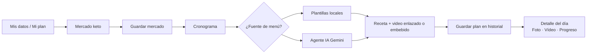

# Flujo unificado de usuario (TEC Nutri Salud)

Documento corto para alinear negocio y pantallas. La app sigue **un orden fijo en producto**: datos → mercado → menú.

## Idea central

**Mis datos → Mercado keto → Cronograma** (menú con recetas y video).  
Las cantidades del cronograma son **orientativas para 1 persona**; si cocinas para más comensales, multiplicas proporciones. El mercado puede planificarse para varias personas en la lista de compra; el texto de cada receta del menú se simplifica a **una porción** para escalar mentalmente.

La implementación expone este orden en:

- `src/lib/recorrido.ts` — definición única de pasos y rutas.
- `src/components/StepHeader.tsx` — franja "paso X de 3" en Mi plan, Mercado y Cronograma.
- `src/components/Layout.tsx` — navegación con **Resumen** (`/#/mi-espacio`) visible antes del orden Datos → Mercado → Menú (…).

---

## Mi resumen / Tu espacio

Pantalla **`/#/mi-espacio`** (`MiEspacio.tsx`): vista rápida del avance en los tres pasos (perfil guardado, mercado activo con nombre/nota, último plan de menú con título y "hace N días"), **siguiente paso sugerido**, accesos rápidos a todas las secciones y herramientas de respaldo (descargar / restaurar JSON). Con Supabase configurado y sesión iniciada por **correo y contraseña**, incluye también **seguridad de la cuenta**: cambiar contraseña desde aquí u orientación si el acceso es solo con Google. Con sesión puede **traer desde la nube** mercados y planes guardados (botón dedicado).

---

## Iniciar sesión y cuenta (Supabase opcional)

- **`/#/login`:** registro o acceso con email/contraseña o Google cuando el proyecto tiene `VITE_SUPABASE_*`; enlace **“¿Olvidaste tu contraseña?”** que envía correo de recuperación.
- Tras pulsar el enlace del correo, la SPA abre **`/#/actualizar-clave`** para establecer nueva contraseña (Supabase marca la sesión en modo recuperación). Las URLs de redirección deben estar declaradas en el panel Supabase (`docs/DEPLOYMENT.md`).

---

## Pasos numerados

1. **Mis datos (Mi plan)**  
   Perfil: datos corporales, gustos, estilo de dieta. Debe hacerse **primero** para que mercado y cronograma respeten exclusiones y modo nutricional orientativo.  
   Soporta **varios perfiles** (multiperfil local): selector global en la barra superior, CRUD en Mi plan; cada perfil tiene su propio mercado activo y cronogramas guardados.

2. **Mercado keto**  
   Días y comensales para la **lista de compra**. Marcas lo comprado (o "todo de una vez"). Puedes **añadir ítems extra** (fuera del generador) para reflejar toda la despensa. **Guardar mercado realizado** enlaza la despensa al plan y navega al cronograma.  
   Cada mercado guardado puede tener **nombre amigable** ("Semana 19 mayo") y **nota** ("Solo verdurería"), editables desde el historial.

3. **Cronograma**  
   Modo perfil / mercado / mixto; días; **Nuevas combinaciones** (plantillas) o **Agente IA recetas** (con **macros estimadas** y **presupuesto diario** de referencia si definiste meta de peso en Mi plan).  
   Cada comida: **embed de YouTube** cuando la IA devuelve un `youtube_video_id` válido; si no, enlace **"Buscar video para esta receta"**.  
   Los planes se **guardan en historial** con título editable, plan **activo de la semana**, restauración y borrado en “Planes guardados”. Vista **lista** o **calendario** mensual; un clic abre el detalle sin salir de la app.

4. **Detalle del día** (modal desde calendario o lista)  
   Tres pestañas:  
   - **Plan** — recetas; **video embebido** (YouTube nocookie) o búsqueda externa; resumen orientativo **kcal / macros** cuando existan datos.  
   - **Tu registro** — fotos y vídeos propios por comida (IndexedDB + miniaturas); con sesión, **copia automática en la cuenta** (Storage privado del proyecto).  
   - **Progreso** — seguimiento del plan (sí / parcial / no), checklist del día y nota libre.

5. **Asistente** (opcional)  
   Misma API Gemini para **preguntas sueltas**. El menú estructurado por día es siempre el cronograma.

---

## Respaldo de datos

- `MiEspacio.tsx` ofrece **descargar / restaurar** un JSON de respaldo que incluye todas las claves `tec_nutri_salud_*` (perfiles, mercados, cronogramas, listas, claves activas).
- `KetoMercado.tsx` ofrece export/import específico del historial de mercados (fusión por id).
- Las **fotos y vídeos** del cronograma se guardan en **IndexedDB** del navegador y **no** se incluyen en el respaldo JSON (solo sus metadatos si ya se subieron a Supabase Storage).
- Con sesión Supabase, los **mercados y planes guardados** pueden **subirse y fusionarse** desde la nube (tablas `user_market_snapshots` / `user_plan_snapshots`); al iniciar sesión la app intenta **traer** copias recientes (por fecha `updated_at`).

---

## PWA y actualización

La app es instalable como PWA. Cuando hay una nueva versión del service worker lista, aparece automáticamente un **banner en la barra superior** ("Nueva versión disponible — Actualizar / ✕") implementado con `useRegisterSW` de `vite-plugin-pwa`.

---

## Qué hace el agente en recetas

- Devuelve JSON con `titulo`, `receta`, `videoQuery` y campos opcionales **`kcal_estimate`**, **`protein_g`**, **`fat_g`**, **`carb_g`**, **`youtube_video_id`** (11 caracteres) cuando el modelo puede estimarlos; receta orientada a **una porción**.
- Ver contrato en `src/lib/recipesGemini.ts` y plan **`docs/PLAN_MEJORAS_FASE3_NUTRICION_SUPABASE_UI.md`**.

---

## Evolución Fase 3 (ejecución inmediata en roadmap)

Sin cambiar el orden **datos → mercado → cronograma**, las siguientes mejoras quedaron documentadas para implementarse en PR pequeños:

| Qué cambia para la usuaria | Documento fuente |
|----------------------------|------------------|
| Sincronizar en cuenta (Supabase gratis) snapshots clave de mercados y planes + objetivos nutricionales opcionales | `PLAN_MEJORAS_FASE3_…`, Épica F en `MEJORAS_NEGOCIO_Y_PRODUCTO.md` |
| **Ítems extra** agregados a mano al mercado guardado | Idem · historias 13–14 en `USER_STORIES.md` |
| Menú con **toda** la despensa, **macros** y **saldo/resto diario orientativo** (siempre disclaimers) | Idem |
| Video **dentro de la página** donde aplique | Idem · historia 15–16 |

---

## Fuera de este flujo

- **Belleza**: contenido estático de tips por categoría.
- **Cuenta Supabase**: hoy sincroniza **perfil familiar** (`family_json`) + **medios** del diario cuando hay sesión; **plan Fase 3** amplía **mercados y planes** en formato compacto (`MEJORAS_NEGOCIO_Y_PRODUCTO.md` Épica F).

---

*Actualizado: mayo 2026 — fases 2.0–2.5b y épicas A–F; próximo hito técnico: `docs/PLAN_MEJORAS_FASE3_NUTRICION_SUPABASE_UI.md`.*
