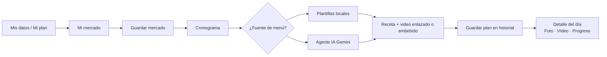

# Flujo unificado de usuario (TEC Nutri Salud)

Documento corto para alinear negocio y pantallas. La app sigue **un orden fijo en producto**: datos → mercado → menú.

## Idea central

**Mis datos → Mi mercado → Cronograma** (menú con recetas y video).  
Las cantidades del cronograma son **orientativas para 1 persona**; si cocinas para más comensales, multiplicas proporciones. El mercado puede planificarse para varias personas en la lista de compra; el texto de cada receta del menú se simplifica a **una porción** para escalar mentalmente.

La implementación expone este orden en:

- `src/lib/recorrido.ts` — definición única de pasos y rutas.
- `src/components/StepHeader.tsx` — franja "paso X de 3" en Mi plan, Mercado y Cronograma.
- `src/components/Layout.tsx` — navegación con **Resumen** (`/#/mi-espacio`) visible antes del orden Datos → Mercado → Menú (…).

---

## Mi resumen / Tu espacio

Pantalla **`/#/mi-espacio`** (`MiEspacio.tsx`): vista rápida del avance en los tres pasos (perfil guardado, mercado activo con nombre/nota, último plan de menú con título y "hace N días"), **siguiente paso sugerido**, accesos rápidos a todas las secciones y herramientas de respaldo (descargar / restaurar JSON). Con Supabase configurado y sesión iniciada por **correo y contraseña**, incluye también **seguridad de la cuenta**: cambiar contraseña desde aquí u orientación si el acceso es solo con Google. Con sesión puede **traer desde la nube** mercados y planes guardados (botón dedicado).

---

## Iniciar sesión y cuenta (Supabase opcional)

- **`/#/login`:** registro o acceso con email/contraseña o Google cuando el proyecto tiene `VITE_SUPABASE_*`; enlace **“¿Olvidaste tu contraseña?”** que envía correo de recuperación.
- Tras pulsar el enlace del correo, la SPA abre **`/#/actualizar-clave`** para establecer nueva contraseña (Supabase marca la sesión en modo recuperación). Las URLs de redirección deben estar declaradas en el panel Supabase (`docs/DEPLOYMENT.md`).

---

## Pasos numerados

1. **Mis datos (Mi plan)**  
   Perfil: datos corporales, gustos, estilo de dieta. Debe hacerse **primero** para que mercado y cronograma respeten exclusiones y modo nutricional orientativo.  
   Soporta **varios perfiles** (multiperfil local): selector global en la barra superior, CRUD en Mi plan; cada perfil tiene su propio mercado activo y cronogramas guardados.

2. **Mi mercado** (`/#/keto-mercado`; ruta heredada)  
   Días y comensales para la **lista de compra**. Dos formas de generar:
   - **Lista base** (según tipo de dieta del perfil: catálogos keto, mediterráneo o balanceado; cantidades orientativas).
   - **Generar con IA ✦** primero cuando hay clave; luego opción lista base; la IA usa el perfil completo.

   Marcas lo comprado (o "todo de una vez"). Puedes **añadir ítems extra**. **Copiar texto** / **PDF** opcionales. **Guardar mercado realizado** enlaza la despensa al plan y puede navegar al cronograma.
   Cada mercado guardado puede tener **nombre amigable** ("Semana 19 mayo") y **nota** ("Solo verdurería"), editables desde el historial.

3. **Cronograma**  
   Modo perfil / mercado / mixto; días; **Nuevas combinaciones** (plantillas) o **Agente IA recetas**. La IA actúa como dietista experto en el tipo de dieta del perfil: calcula TDEE + déficit/superávit según la meta de peso y lo convierte en objetivo calórico diario con distribución de macros (keto 70/25/5 · mediterránea 35/20/45 · balanceada 30/20/50); todos los platos devuelven `kcal_estimate`, `protein_g`, `fat_g`, `carb_g`.
   Al volver a la página, el plan IA activo se restaura automáticamente sin necesidad de regenerar.  
   Cada comida: **embed de YouTube** solo si hay `youtube_video_id` que pasa miniatura/embed; si no, enlaces destacados para **buscar vídeo**.
   Los planes se **guardan en historial** con título editable, plan **activo de la semana**, restauración y borrado en “Planes guardados”. Vista **lista** o **calendario** mensual; un clic abre el detalle sin salir de la app.

4. **Detalle del día** (modal desde calendario o lista)  
   Tres pestañas:  
   - **Plan** — recetas con etiqueta de **porciones**; resumen del día en **tarjetas de colores**; **video embebido** YouTube cuando el ID es válido y admite incrustación; si falla, fallback a **«Ver receta en YouTube»** (búsqueda); enlace a más resultados.  
   - **Tu registro** — fotos y vídeos propios por comida (IndexedDB + miniaturas); con sesión, **copia automática en la cuenta** (Storage privado del proyecto).  
   - **Progreso** — seguimiento del plan (sí / parcial / no), checklist del día y nota libre.

5. **Asistente** (opcional)  
   Misma API Gemini para **preguntas sueltas**. El menú estructurado por día es siempre el cronograma.

---

## Respaldo de datos

- `MiEspacio.tsx` ofrece **descargar / restaurar** un JSON de respaldo que incluye todas las claves `tec_nutri_salud_*` (perfiles, mercados, cronogramas, listas, claves activas).
- `KetoMercado.tsx` ofrece export/import específico del historial de mercados (fusión por id).
- Las **fotos y vídeos** del cronograma se guardan en **IndexedDB** del navegador y **no** se incluyen en el respaldo JSON (solo sus metadatos si ya se subieron a Supabase Storage).
- Con sesión Supabase, los **mercados y planes guardados** pueden **subirse y fusionarse** desde la nube (tablas `user_market_snapshots` / `user_plan_snapshots`); al iniciar sesión la app intenta **traer** copias recientes (por fecha `updated_at`). Al **borrar** un mercado o plan localmente, se elimina también la fila remota si hay sesión activa.

---

## PWA y actualización

La app es instalable como PWA. Cuando hay una nueva versión del service worker lista, aparece automáticamente un **banner en la barra superior** ("Nueva versión disponible — Actualizar / ✕") implementado con `useRegisterSW` de `vite-plugin-pwa`.

---

## Qué hace el agente en recetas

- Devuelve JSON con `titulo`, `receta`, `videoQuery`, `porciones` (1–4, cuántas raciones cubre la preparación) y campos opcionales **`kcal_estimate`**, **`protein_g`**, **`fat_g`**, **`carb_g`**, **`fiber_g`**, **`youtube_video_id`** (11 caracteres válidos) cuando el modelo puede estimarlos.
- El prompt recibe **toda la lista del mercado con cantidades y unidades** (no solo los comprados); la instrucción varía según modo: mercado activo prioriza comprados estrictamente, mixto combina, perfil usa la lista como despensa probable.
- Tras recibir la respuesta principal, una **segunda pasada** pide IDs de YouTube para los slots sin vídeo, verifica cada ID cargando la miniatura real (`i.ytimg.com`) y solo asigna los que confirman.
- Ver contrato en `src/lib/recipesGemini.ts` y plan **`docs/PLAN_MEJORAS_FASE3_NUTRICION_SUPABASE_UI.md`**.

---

## Mejoras UX implementadas (mayo 2026)

Mejoras adicionales sobre el flujo base, sin cambiar el orden datos → mercado → cronograma:

| Pantalla | Mejora |
|----------|--------|
| **Cronograma** | Barra de progreso durante generación IA ("Generando días… X/Y") con porcentaje; botón **Reintentar** al fallar. Botón **Copiar plan** (texto del cronograma completo al portapapeles). Estado vacío guiado cuando no hay plan activo. Badges por día (kcal · proteína · grasa · IA · vídeo). |
| **Cronograma — modal día** | Botón **Copiar** en cada receta. Macro badges por comida. |
| **Mi mercado** | Navegación por categorías (incluye cereales, frutas, legumbres en dieta mediterránea/balanceada). Barra global de progreso. Contador **X/Y** comprados por sección. Eliminación y edición de cantidades en línea. Filtro "Solo pendientes". Export PDF/texto. |
| **Asistente** | Respuestas en Markdown (encabezados, listas, negrita). Chips de sugerencias rápidas. Historial de preguntas recientes en `localStorage`. |
| **Mis datos (Mi plan)** | Indicador de completitud del perfil (barra + nivel: Básico / Recomendado / Detallado). |
| **Mi espacio** | CTA "Siguiente paso" como banner destacado con gradiente en la parte superior. Badges de antigüedad (verde/ámbar/rojo) en mercado y plan activo. |
| **Belleza** | Barra de navegación sticky con anclas a cada categoría. |
| **Inicio de sesión** | Botón mostrar/ocultar contraseña. |
| **404** | Página propia con CTA al inicio y al cronograma. |

---

## Fuera de este flujo

- **Belleza**: contenido estático de tips por categoría.
- **Cuenta Supabase**: hoy sincroniza **perfil familiar** (`family_json`) + **medios** del diario cuando hay sesión; **plan Fase 3** amplía **mercados y planes** en formato compacto (`MEJORAS_NEGOCIO_Y_PRODUCTO.md` Épica F).

---

*Actualizado: mayo 2026 — fases 2.0–4.x, épicas A–F; Fase 4: Mercado IA, cronograma calórico experto, persistencia plan IA, logout limpio.*
