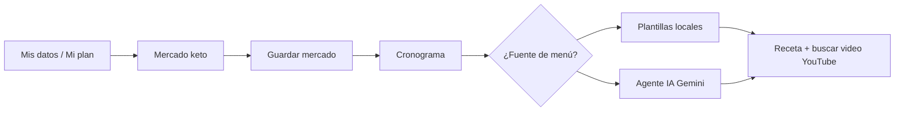

# Flujo unificado de usuario (TEC Nutri Salud)

Documento corto para alinear negocio y pantallas. La app sigue **un orden fijo en producto**: datos → mercado → menú.

## Idea central

**Mis datos → Mercado keto → Cronograma** (menú con recetas y video).  
Las cantidades del cronograma son **orientativas para 1 persona**; si cocinas para más comensales, multiplicas proporciones. El mercado puede planificarse para varias personas en la lista de compra; el texto de cada receta del menú se simplifica a **una porción** para escalar mentalmente.

La implementación expone este orden en:

- `src/lib/recorrido.ts` — definición única de pasos y rutas.
- `src/components/StepHeader.tsx` — franja “paso X de 3” en Mi plan, Mercado y Cronograma.
- `src/components/Layout.tsx` — navegación desktop y móvil en el mismo orden (Datos, Mercado, Menú, …).

## Pasos numerados

1. **Mis datos (Mi plan)**  
   Perfil: datos corporales, gustos, estilo de dieta. Debe hacerse **primero** para que mercado y cronograma respeten exclusiones y modo nutricional orientativo.

2. **Mercado keto**  
   Días y comensales para la **lista de compra**. Marcas lo comprado (o “todo de una vez”). **Guardar mercado realizado** enlaza la despensa al plan y navega al cronograma.

3. **Cronograma**  
   Modo perfil / mercado / mixto; días; **Nuevas combinaciones** (plantillas) o **Agente IA recetas**.  
   Cada comida: **“Buscar video para esta receta”** (YouTube alineado al plato + estilo de dieta).

4. **Asistente** (opcional)  
   Misma API Gemini para **preguntas sueltas**. El menú estructurado por día es siempre el cronograma.

## Qué hace el agente en recetas

- Devuelve JSON con `titulo`, `receta` y `videoQuery`.
- **Receta**: *Ingredientes (1 porción)* + *Pasos*, con cantidades medibles.
- **videoQuery**: coherentes con el plato para YouTube (solo búsqueda).

## Fuera de este flujo

- **Belleza**: contenido estático de tips.
- **Cuenta Supabase**: sincroniza perfil en la nube; no sincroniza el historial de mercados en el MVP.
