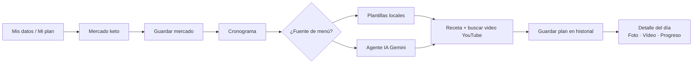

# Flujo unificado de usuario (TEC Nutri Salud)

Documento corto para alinear negocio y pantallas. La app sigue **un orden fijo en producto**: datos → mercado → menú.

## Idea central

**Mis datos → Mercado keto → Cronograma** (menú con recetas y video).  
Las cantidades del cronograma son **orientativas para 1 persona**; si cocinas para más comensales, multiplicas proporciones. El mercado puede planificarse para varias personas en la lista de compra; el texto de cada receta del menú se simplifica a **una porción** para escalar mentalmente.

La implementación expone este orden en:

- `src/lib/recorrido.ts` — definición única de pasos y rutas.
- `src/components/StepHeader.tsx` — franja "paso X de 3" en Mi plan, Mercado y Cronograma.
- `src/components/Layout.tsx` — navegación con **Resumen** (`/#/mi-espacio`) visible antes del orden Datos → Mercado → Menú (…).

---

## Mi resumen / Tu espacio

Pantalla **`/#/mi-espacio`** (`MiEspacio.tsx`): vista rápida del avance en los tres pasos (perfil guardado, mercado activo con nombre/nota, último plan de menú con título y "hace N días"), **siguiente paso sugerido**, accesos rápidos a todas las secciones y herramientas de respaldo (descargar / restaurar JSON). No sustituye los pasos numerados.

---

## Pasos numerados

1. **Mis datos (Mi plan)**  
   Perfil: datos corporales, gustos, estilo de dieta. Debe hacerse **primero** para que mercado y cronograma respeten exclusiones y modo nutricional orientativo.  
   Soporta **varios perfiles** (multiperfil local): selector global en la barra superior, CRUD en Mi plan; cada perfil tiene su propio mercado activo y cronogramas guardados.

2. **Mercado keto**  
   Días y comensales para la **lista de compra**. Marcas lo comprado (o "todo de una vez"). **Guardar mercado realizado** enlaza la despensa al plan y navega al cronograma.  
   Cada mercado guardado puede tener **nombre amigable** ("Semana 19 mayo") y **nota** ("Solo verdurería"), editables desde el historial.

3. **Cronograma**  
   Modo perfil / mercado / mixto; días; **Nuevas combinaciones** (plantillas) o **Agente IA recetas**.  
   Cada comida: **"Buscar video para esta receta"** (YouTube alineado al plato + estilo de dieta).  
   Los planes se **guardan en historial** con título editable, se puede marcar uno como **"plan activo de la semana"** y restaurar, renombrar o borrar cualquiera desde el panel "Planes guardados".  
   Vista **Lista** o **Calendario** mensual; clic en un día abre el detalle **sin salir de la app**.

4. **Detalle del día** (modal desde calendario o lista)  
   Tres pestañas:  
   - **Plan** — recetas sugeridas + enlace a YouTube (solo como acción explícita).  
   - **Tu registro** — fotos y vídeos propios por comida (IndexedDB + miniaturas); subida opcional a Supabase Storage si hay sesión activa.  
   - **Progreso** — seguimiento del plan (sí / parcial / no), checklist del día y nota libre.

5. **Asistente** (opcional)  
   Misma API Gemini para **preguntas sueltas**. El menú estructurado por día es siempre el cronograma.

---

## Respaldo de datos

- `MiEspacio.tsx` ofrece **descargar / restaurar** un JSON de respaldo que incluye todas las claves `tec_nutri_salud_*` (perfiles, mercados, cronogramas, listas, claves activas).
- `KetoMercado.tsx` ofrece export/import específico del historial de mercados (fusión por id).
- Las **fotos y vídeos** del cronograma se guardan en **IndexedDB** del navegador y **no** se incluyen en el respaldo JSON (solo sus metadatos si ya se subieron a Supabase Storage).

---

## PWA y actualización

La app es instalable como PWA. Cuando hay una nueva versión del service worker lista, aparece automáticamente un **banner en la barra superior** ("Nueva versión disponible — Actualizar / ✕") implementado con `useRegisterSW` de `vite-plugin-pwa`.

---

## Qué hace el agente en recetas

- Devuelve JSON con `titulo`, `receta` y `videoQuery`.
- **Receta**: *Ingredientes (1 porción)* + *Pasos*, con cantidades medibles.
- **videoQuery**: coherente con el plato para YouTube (solo búsqueda).

---

## Fuera de este flujo

- **Belleza**: contenido estático de tips por categoría.
- **Cuenta Supabase**: sincroniza perfil en la nube; los mercados y cronogramas son **locales en esta versión** (roadmap Épica E).

---

*Actualizado: mayo 2026 — refleja fases 2.0–2.5b y épicas A–D del plan de mejoras.*
