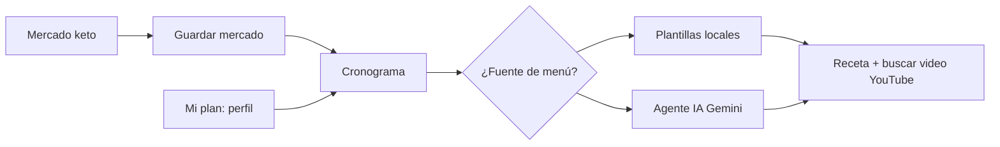

# Flujo unificado de usuario (TEC Nutri Salud)

Documento corto para alinear negocio y pantallas. La app sigue un solo camino lógico.

## Idea central

**Mercado real → perfil → cronograma con recetas y video.**  
Las cantidades del cronograma son **orientativas para 1 persona**; si cocinas para más comensales, multiplicas proporciones. El mercado keto puede planificarse para varias personas en la lista de compra; el texto de cada receta del menú se simplifica a **una porción** para que sea fácil de escalar mentalmente.

## Pasos numerados

1. **Mercado keto**  
   Eliges días y comensales para la **lista de compra**. Marcas lo comprado (o “todo de una vez”). **Guardar mercado realizado** crea el vínculo con el plan y te lleva al cronograma.

2. **Mi plan**  
   Perfil (datos, gustos, estilo de dieta). Opcional antes del mercado si ya conoces tu perfil; si no, puedes hacerlo después.

3. **Cronograma**  
   Eliges **modo**: solo perfil, mercado activo o mixto; número de días; **Nuevas combinaciones** (plantillas) o **Agente IA recetas**.  
   Cada comida muestra texto de receta y **“Buscar video para esta receta”**: abre YouTube con una búsqueda que incluye el **nombre del plato**, las palabras clave del modelo y tu **estilo de dieta** (keto / mediterránea / saludable).

4. **Asistente**  
   Misma API Gemini para **preguntas sueltas** (orientativo). Para menús estructurados por día, el camino oficial es el cronograma con agente IA.

## Qué hace el agente en recetas

- Devuelve JSON con `titulo`, `receta` y `videoQuery`.
- **Receta**: formato acordado *Ingredientes (1 porción)* + *Pasos*, con cantidades medibles.
- **videoQuery**: coherentes con el plato para mejorar la relevancia en YouTube (sin URLs embebidas; solo búsqueda).

## Fuera de este flujo

- **Belleza**: contenido estático de tips.
- **Cuenta Supabase**: sincroniza perfil en la nube; no sincroniza el historial de mercados en el MVP.
